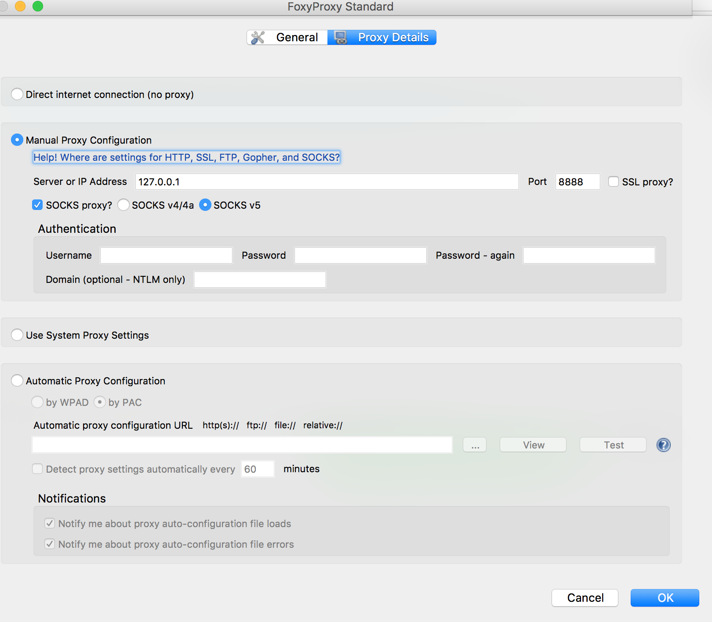

# Connecting to your instance on the cloud

If you're using EC2 or any other cloud provider as a means to test out red-pnda, then chances are you might not be able to connect to the PNDA console through an elastic IP.

Here are the steps to overcome the limitation:

* ssh to your cloud instance with a '-D' flag
       
        ssh -i /path/to/your/key.pem -D 8888 ubuntu@54.x.x.x 
        
* Download FoxyProxy extension for your browser. Please use the following links to download

	[Chrome](https://chrome.google.com/webstore/detail/foxyproxy-standard/gcknhkkoolaabfmlnjonogaaifnjlfnp?hl=en)
	
	[Firefox](https://addons.mozilla.org/en-US/firefox/addon/foxyproxy-standard/)
	
* Click on the FoxyProxy Icon, you should see this window

	

Then click on the first selection and then click on 'Edit Selection'
	
* Configure the FoxyProxy extension to look like this:

Click 'OK'. Make sure the extension is enabled, you should see a blue indicator to the right of your address bar!

* Type the private IP of your ec2 instance in the browser and behold, Magic!

 