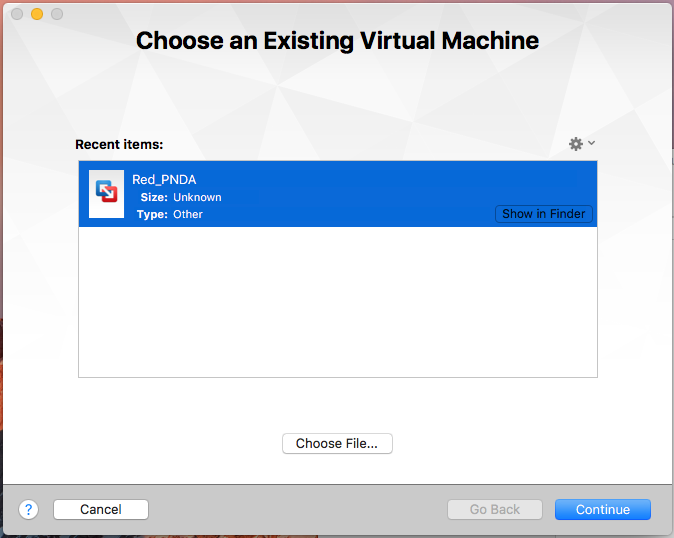
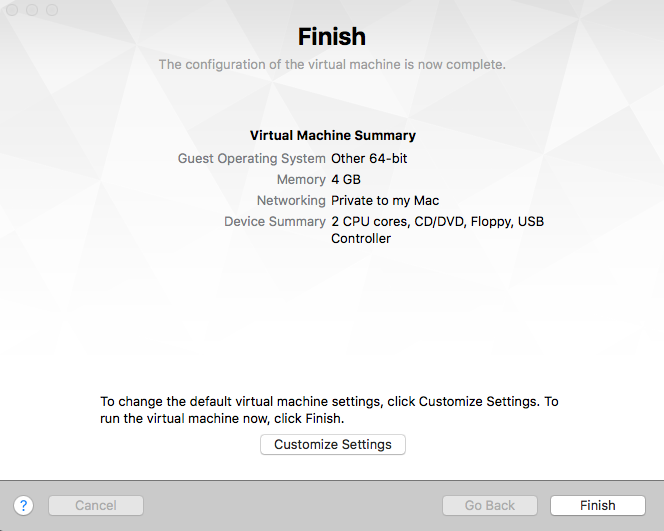
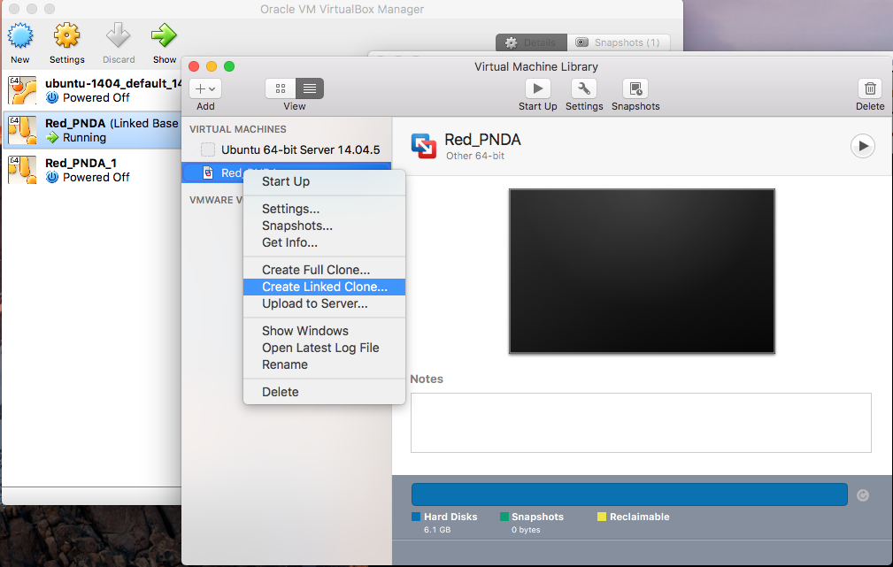
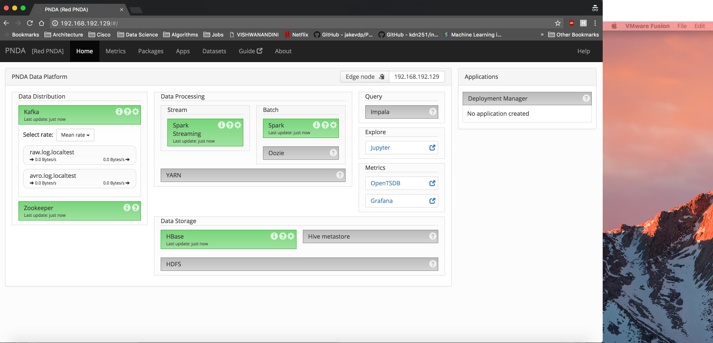

# Installing on Fusion Guide

## Detailed How To

**Step 1:** Open VMware Fusion, go to File -> Import and choose the Red PNDA ova file & click on Continue.

**Step 2:** Click Save on the default location prompted and wait until the import is finished and then click Finish.

**Step 3:** Right click on the Red PNDA VM and click on Linked Clone & click Save on the default location prompted.

**Step 4:** Start the Cloned Red PNDA VM

**Step 8:** Use the default credentials (pnda/pnda) to login.

**Step 7:** Run `ifconfig` command to check which network interface is reachable from host machine, in my case its `eth0`

**Step 9:** Run the following command:

    sudo sh assign-ip.sh eth0

If prompted for password, enter `pnda`

Open a browser and navigate to reachable address, in my case its `192.168.192.129`:

Congratulations! You just installed Red PNDA.

## Important 

By default we provide host-only adapter by default. By using this type of adapter, you’ll be able to access a private, virtual network consisting solely of your host and any guests. Any of the member machines can access each other, but you can't access outside traffic i.e. Internet.

If you need internet access, consider changing the network adapter from 'Private to my Mac' to '**Share with my Mac**' (although, this is Mac specific similar steps apply for Windows/Linux OS) and reboot.

