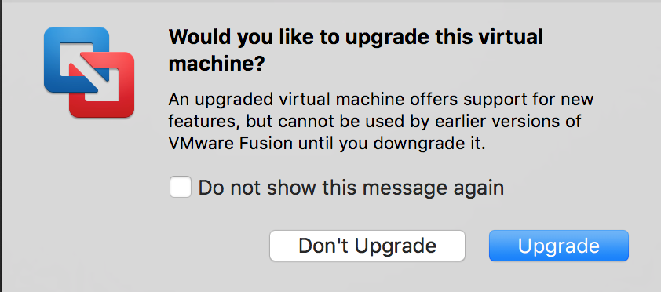
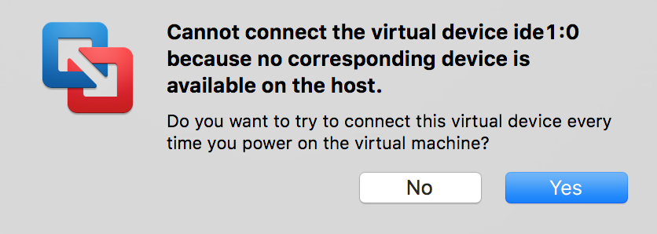
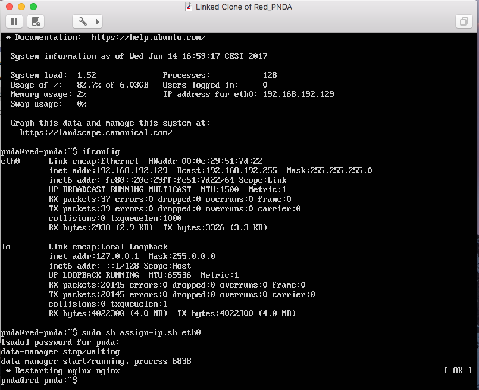
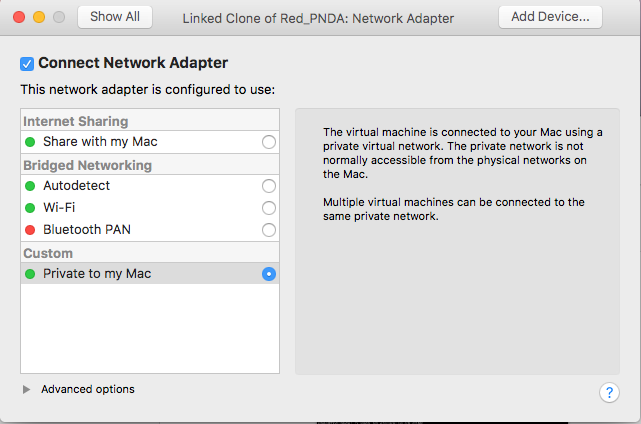

# Installing on Vmware Fusion Guide

## Detailed How To
You must already have Vmware Fusion installed on your Mac.

**Step 1:** Open Vmware Fusion, go to File -> Import menu and select the Red PNDA .ova file. Click "Continue".

**Step 2:** Click "Save" on the default location prompted. Click on "Retry" if it complains about the import.

Wait until the import is finished and then click "Finish".

Click "Upgrade" if prompted

Click "Yes" if prompted.

**Step 3:** Right click on the Red PNDA VM and click on "Linked Clone" & click "Save" on the default location prompted.

**Step 4:** Start the Cloned Red PNDA VM

**Step 8:** Use the default credentials (pnda/pnda) to login.

**Step 7:** Run the `ifconfig` command to check which network interface is reachable from host machine. In this example it is `eth0`.

**Step 9:** Run the following command:

    sudo sh assign-ip.sh eth0

If prompted for s password, enter `pnda`

Open a browser and navigate to reachable address. In this example, the address is `192.168.192.129`:

Congratulations! You successfully installed Red PNDA.

## Important 

By default, the virtual machine network adapter is configured for 'host-only' operation. By using this type of adapter, you’ll be able to access a private, virtual network consisting solely of your host and any guest virtual machines. Any of the virtual machines can access each other, but you can't access outside traffic i.e. reach the Internet.

If you need Internet access, consider changing the network adapter's configuration from 'Private to my Mac' to '**Share with my Mac**' (although, this is Mac-specific, similar steps apply for Vmware Workstation for Windows/Linux).

Be sure to reboot your VM if you change the network settings and run the `assign-ip.sh` script as shown in Step 9 above.

