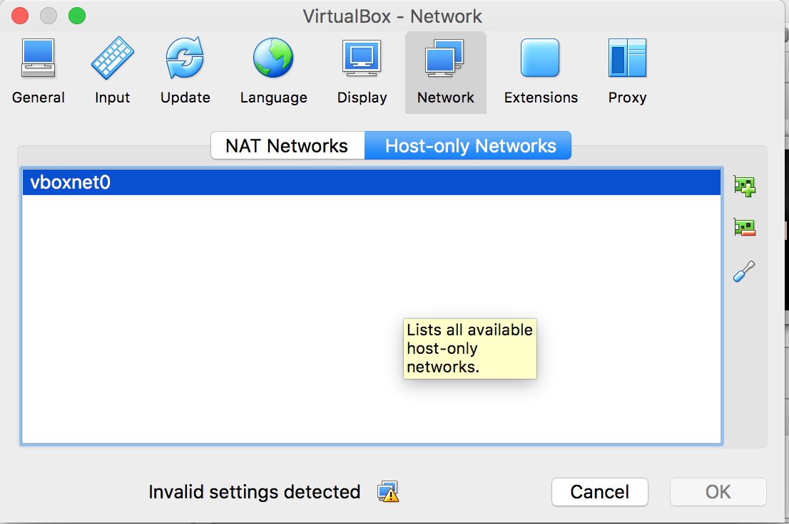
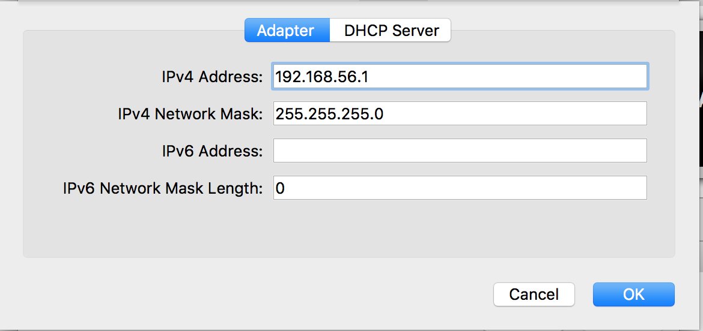
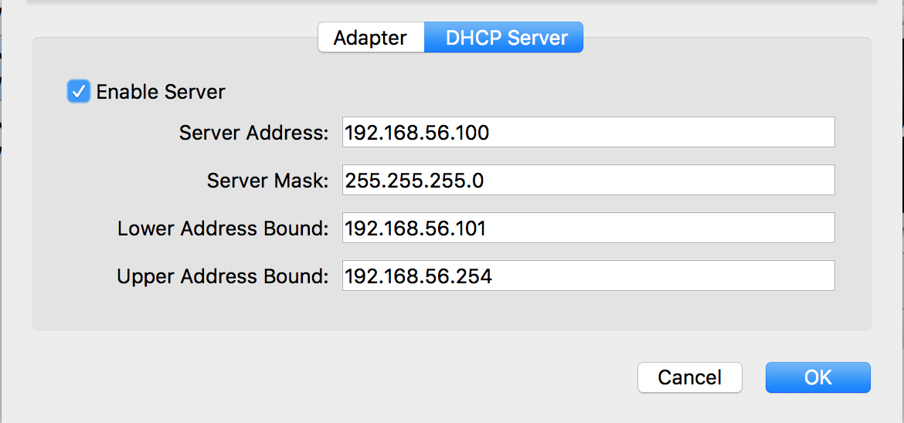
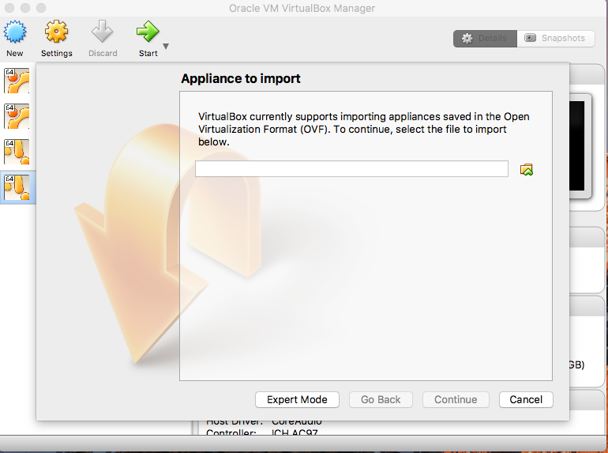
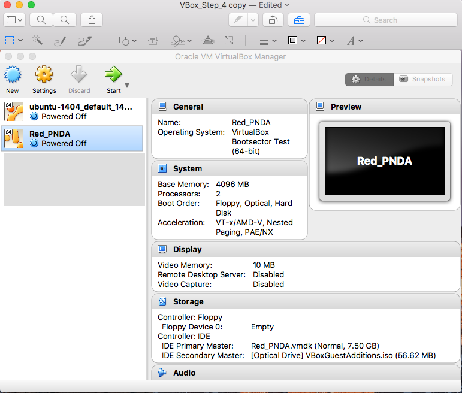
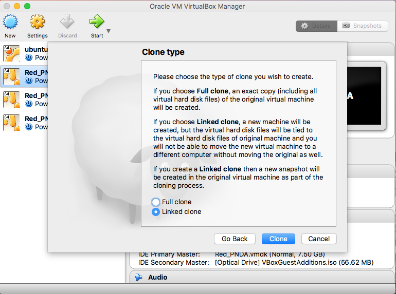
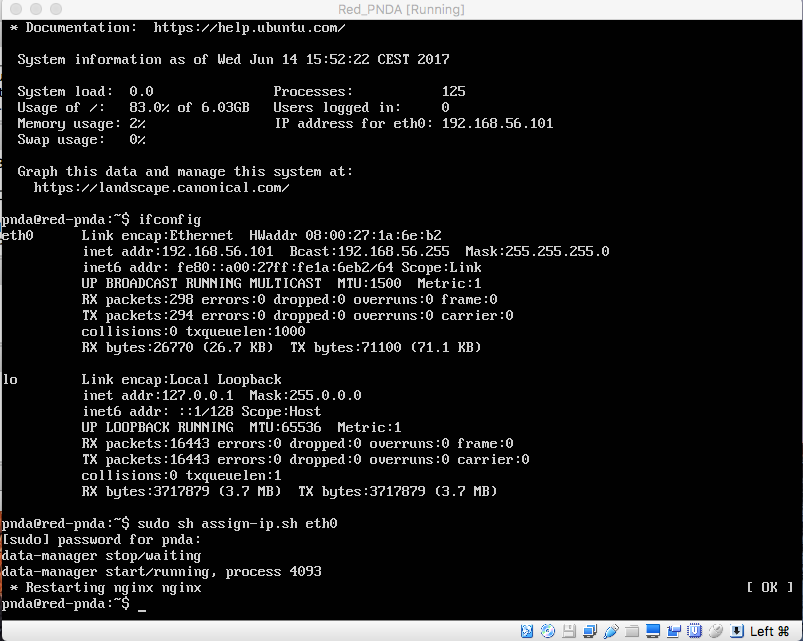

# Installing on VirtualBox Guide

If you don't have VirtualBox installed, please download it [here](https://www.virtualbox.org/wiki/Downloads) and follow the appropriate installation instructions for your host computer's operating system.

## Detailed How To

**Step 0:** Before we begin, it's important to have a host-only network set up on Virtualbox.
If you don't have one, go to Preferences -> Network -> Host-Only Networks

If the list is empty, please click on the Add button the right to create a Host-Only network.

You should see something like this:

Click on DHCP Server tab and click on Enable Server.

Click Ok and exit.

**Step 1:** Open VirtualBox and select File -> Import Appliance from the menu.

**Step 2:** Select the Red PNDA OVA file from its current location.

Click "Continue"

**Step 3:** Click "Import". It is not recommended to adjust the default OVA settings.

**Step 4:** You should now see the Virtual Machine image installed and ready to go.

**Step 5:** It is recommended that you create a 'linked clone' of the base VM. In case there's a problem, you are able to quickly create a new working image without reinstalling from the OVA file.

Click "Continue"

**Step 6:** Click on "Linked Clone" and click "Clone".

**Step 7:** Press "Start" to boot the cloned VM.

**Step 8:** Use the default credentials (pnda/pnda) to login.

**Step 9:** Run `ifconfig` command to check which network interface is reachable from host machine. In this example `eth0` is the active interface.

**Step 10:** Run the following command:

    sudo sh assign-ip.sh eth0

If prompted for a password, enter `pnda`

Open a browser and navigate to reachable address. In this example, the address is `192.168.56.101`:

Congratulations! You've successfully installed Red PNDA.

## Important 

By default a 'host-only' network adapter is provided. By using this type of adapter, you’ll be able to access a private, virtual network consisting solely of your host and any guest virtual machines. Any of the guest virtual machines can access each other, but you can't access outside traffic i.e. reach the Internet.

If you need internet access, you have two options:

* Consider changing the network adapter's 'attached to' setting from 'Host-Only' to 'Bridged'.

*  Add a second adapter with the adapter's 'attached to' setting set to 'NAT'.

If you do add a second network adapter, be careful not be specify the interface listing `eth0` IP for the Step 9 listed above.

Be sure to reboot your VM if you change the network settings and run the `assign-ip.sh` script as shown in Step 10 above.
