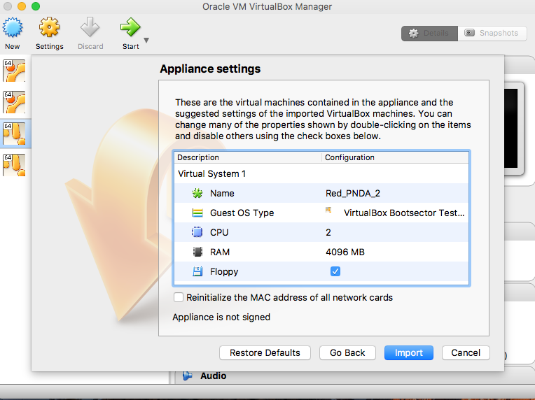
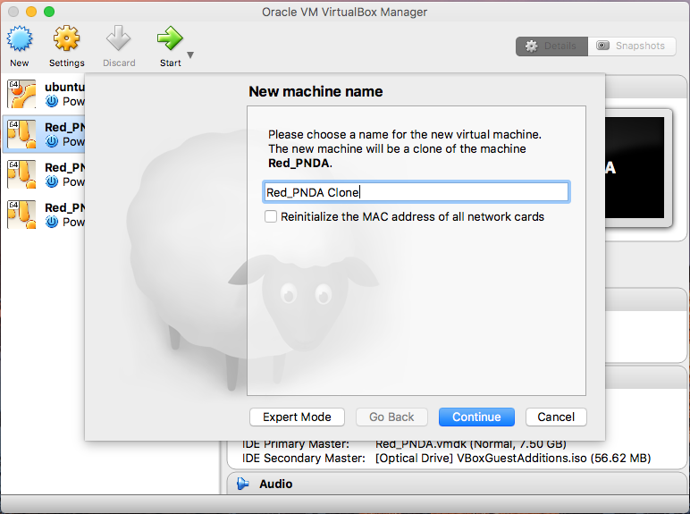
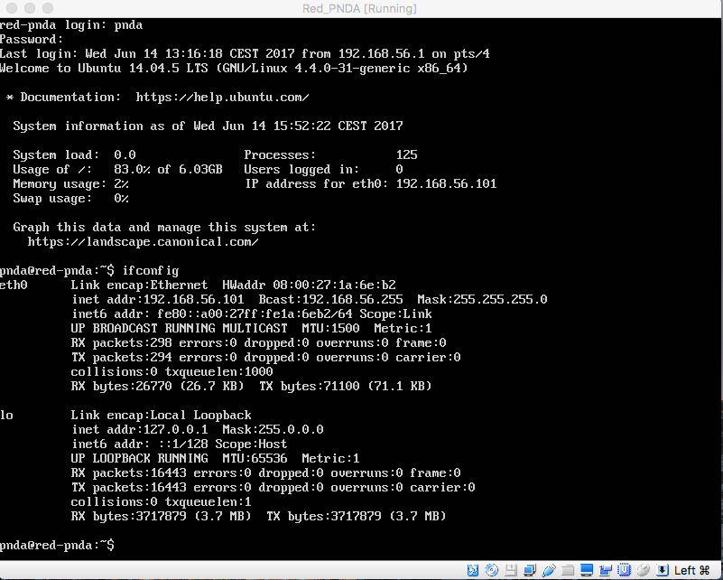
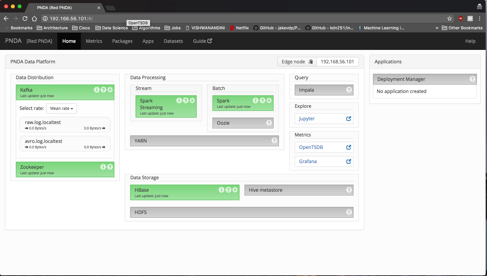
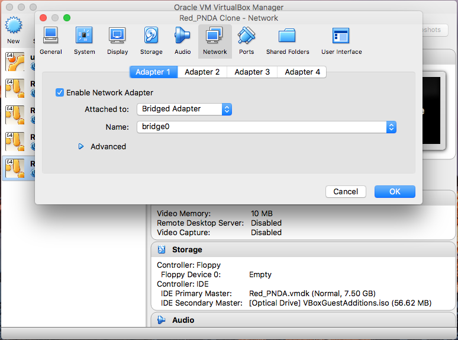
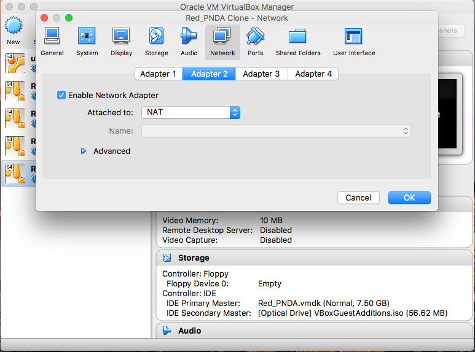

# Installing on VirtualBox Guide

If you don't have VirtualBox installed, please download it [here](https://www.virtualbox.org/wiki/Downloads) and follow the appropriate installation instructions for your host computer's operating system.

## Detailed How To

**Step 1:** Open VirtualBox and select File -> Import Appliance from the menu.

**Step 2:** Select the Red PNDA OVA file from its current location.

Click "Continue"

**Step 3:** Click "Import". It is not recommended to adjust the default OVA settings.

**Step 4:** You should now see the VMDK installed and ready to go.

**Step 5:** Create a linked clone of the base VM, just so that in case there's a problem we can always go back to the base VM.

Click Continue

**Step 6:** Click on Linked Clone and click Clone.

**Step 7:** Press Start to boot up the cloned VM.

**Step 8:** Use the default credentials (pnda/pnda) to login.

**Step 7:** Run `ifconfig` command to check which network interface is reachable from host machine, in my case its `eth0`.

**Step 9:** Run the following command:

    sudo sh assign-ip.sh eth0

If prompted for password, enter `pnda`

Open a browser and navigate to reachable address, in my case its `192.168.56.101`:

Congratulations! You just installed Red PNDA.

## Important 

By default we provide host-only adapter by default. By using this type of adapter, you’ll be able to access a private, virtual network consisting solely of your host and any guests. Any of the member machines can access each other, but you can't access outside traffic i.e. Internet.

If you need internet access, you have two options:

* Consider changing the network adapter from Host-Only to Bridged.

*  Add NAT as the second adapter.

If you do use NAT, be careful not be specify the interface listing `10.0.x.x` IP for the Step 8 listed above.

Be sure to reboot your VM, if you change the network settings.
