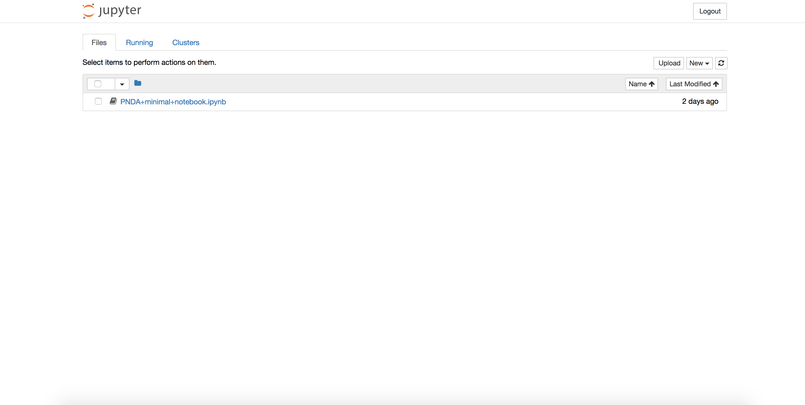
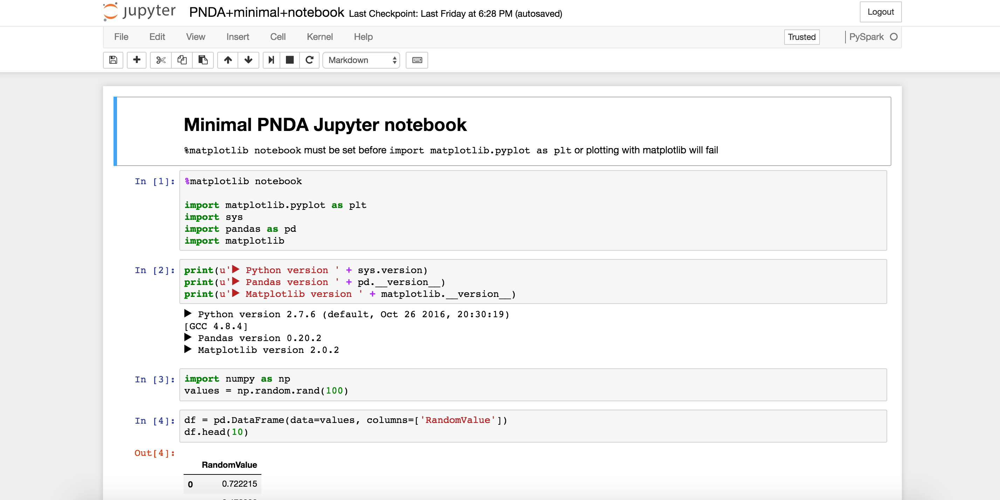
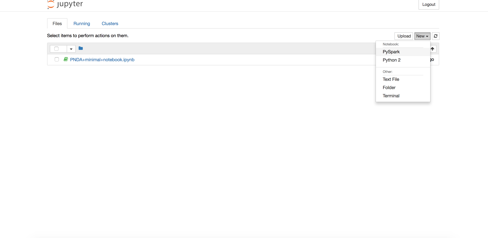

# Jupyter 

### Connecting

Jupyter is deployed with two kernel supports: Python2 kernel and PySpark (Python2) kernel. An example Jupyter notebook is also provided with details instructions on how to rapid prototype using Jupyter PySpark kernel. 

By default, Jupyter is installed on port `9000`. In order to access Jupyter portal go to:

    http://<Accessible-IP>:9000
    
When prompted for a password, enter `pnda`

### QuickStart

You should see a jupyter login page as seen below

Enter `pnda` to login to the server, you should see the default notebook list view

#### Open Example Notebook

Click on the link `PNDA minimal notebook.ipynb` 

### Create a notebook

To create a Spark notebook, click on New -> PySpark kernel.

Edit your file, save it going to File -> Save and Checkpoint.